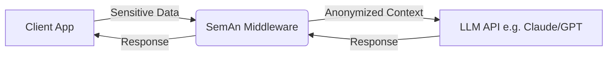

# Semantic Anonymizer (SemAn)

**Context-preserving data anonymization for LLM applications.**

> ⚠️ **Status:** Pre-Alpha / Prototype Phase. This repository is currently under active development as part of a research prototype.

---

## The Problem

Integrating Large Language Models (LLMs) into sensitive domains (Finance, Health, HR) faces a critical dilemma:
- **Deleting data** destroys the context needed for high-quality AI responses.
- **Sending plain text** violates privacy regulations (GDPR) and trust.

Existing solutions often focus on redaction (blacking out text) or generalisation (k-anonymity) but lack a semantic understanding that preserves the *meaning* for the AI while hiding the *identity* of the user.

## The Solution: SemAn

**SemAn** is a TypeScript/Node.js library that transforms sensitive data into semantically equivalent abstract categories before they reach the LLM.

**Example:**
- **Input:** `{"balance": 234.50, "debt": 15000}`
- **Transformation:** `{"liquidity": "critical", "indebtedness": "high"}`

The LLM receives "User has critical liquidity and high indebtedness" instead of the raw numbers. It can generate helpful advice ("Prioritize debt repayment, cut non-essential spending") without ever knowing the user's specific financial details.

## Features (Planned)

- **Declarative Schema:** Define anonymization rules using a Zod-based schema.
- **Semantic Transformers:**
  - `RangeBucket`: Map numbers to categories (e.g., Age 30-35 -> "Early Career").
  - `FuzzyDate`: Shift dates or reduce precision (e.g., "2023-05-12" -> "2023-Q2").
  - `CategoryMapping`: Map specific values to broader groups.
- **Standard Presets:** Built-in configurations for common domains to speed up integration:
  - `GermanFinancePreset`: Standardized buckets for German income, wealth, and pension data.
  - `HealthPreset` (Planned): ICD-10 mappings and health data categorization.
  - `HRPreset` (Planned): Salary bands and role generalizations.
- **Preservation Layer:** Ensures logical consistency between fields is maintained (e.g., start_date < end_date).
- **Re-Identification Risk Check:** Basic validation to warn about potential uniqueness.

## Architecture

SemAn is designed as a lightweight middleware library:



## Installation

```bash
npm install seman
# or
yarn add seman
```

## Usage with Presets

SemAn comes with "batteries included" for specific domains. Here is how to use the **German Finance Preset**:

```typescript
import { SemAn, Schema, GermanFinancePreset } from 'seman';

// 1. Define Schema using built-in Presets
const userSchema = Schema.object({
  age: GermanFinancePreset.ageClass, // Maps 34 -> "30-34"
  netWorth: GermanFinancePreset.netWorthStatus, // Maps 125k -> "Medium"
  pensionGap: GermanFinancePreset.gapCategory, // Maps 1200 -> "Medium Gap"
  
  // Custom rules can be mixed in
  customField: Schema.number().transform('RangeBucket', { ... })
});

// 2. Initialize Engine
const anonymizer = new SemAn(userSchema);

// 3. Transform Data
const sensitiveData = { 
  age: 34, 
  netWorth: 125000,
  pensionGap: 1200 
};

const cleanContext = anonymizer.anonymize(sensitiveData);
console.log(cleanContext);
// Output: { age: "30-34", netWorth: "mittel", pensionGap: "mittel" }
```

## Roadmap

- **Phase 1 (Months 1-2):** Core Engine & Schema Definition
- **Phase 2 (Months 2-3):** Transformer Implementation (Numeric, Date, Categorical)
- **Phase 3 (Months 3-4):** Standard Presets (Finance, Health)
- **Phase 4 (Months 4-5):** Security Audits & Edge Runtime Optimization
- **Phase 5 (Months 5-6):** Public Release & Integration Showcase

## License

MIT
